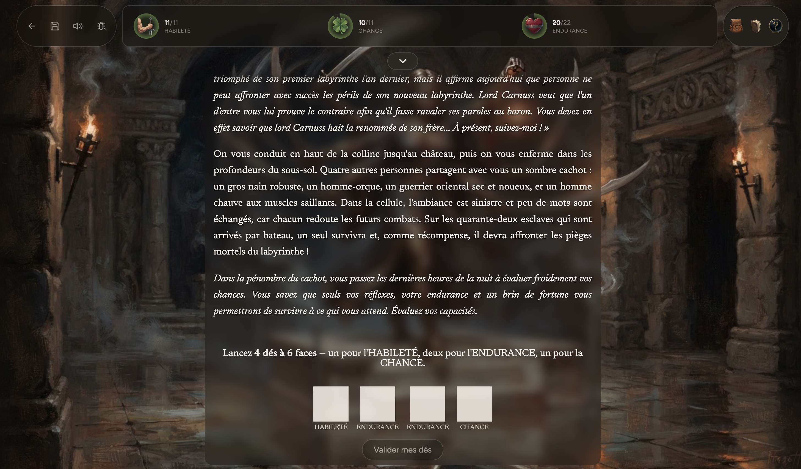
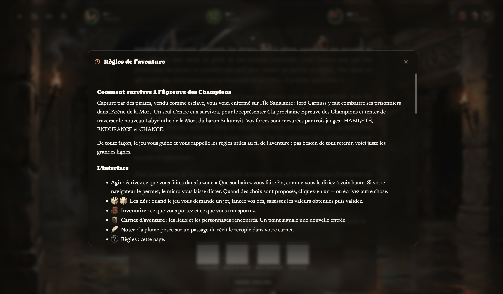

# The Grimoires

**An AI game master for interactive fiction.**

Les Grimoires brings gamebooks back to life with an AI game master: it narrates
the scenes, applies the rules, rolls the dice and follows the story written by
the author. You write freely what your character does; the game master
improvises and brings you back to the story.

## Try it

🎲 Closed alpha, in French: **[lesgrimoires.fr](https://lesgrimoires.fr)**

## How it works

- **Authored adventures, not random stories.** A campaign pipeline turns a
  gamebook into structured data: scenes, characters, places, rules.
- **A game master agent with real tools.** Dice, combat, stats, inventory,
  character memory: the rules are enforced by code, not improvised.
- **Measured, not guessed.** An evaluation harness checks how reliably the model
  calls the right tools, run after run.

## Contact

✉️ contact@lesgrimoires.fr
